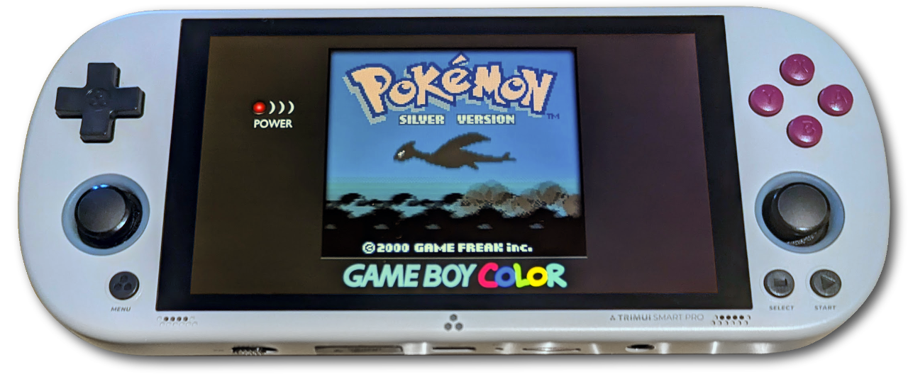
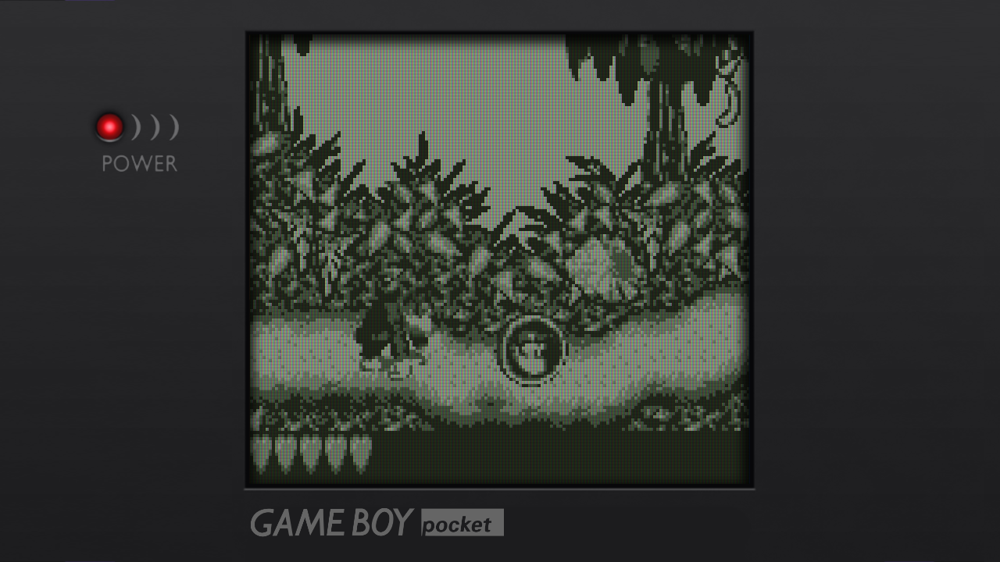
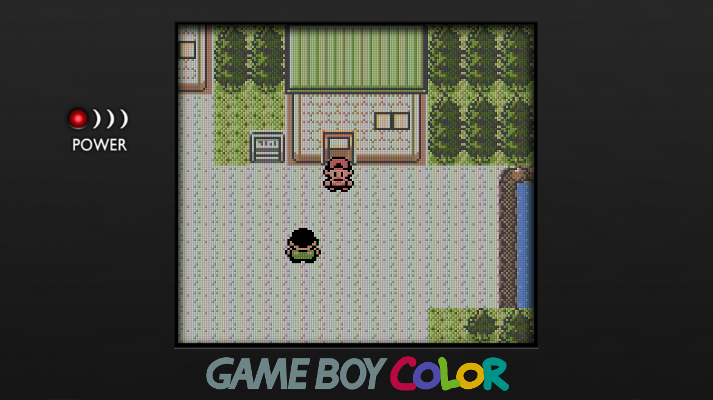
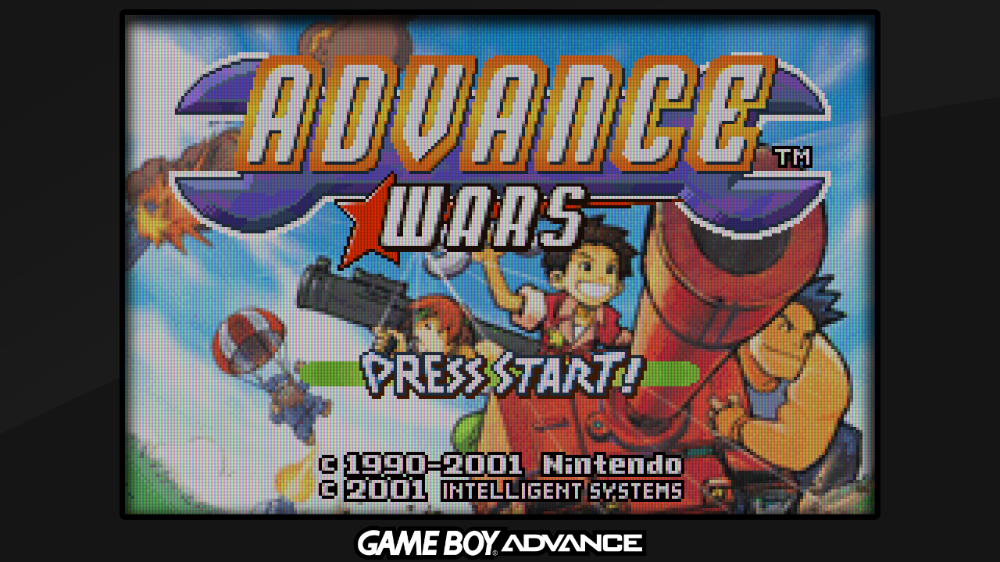
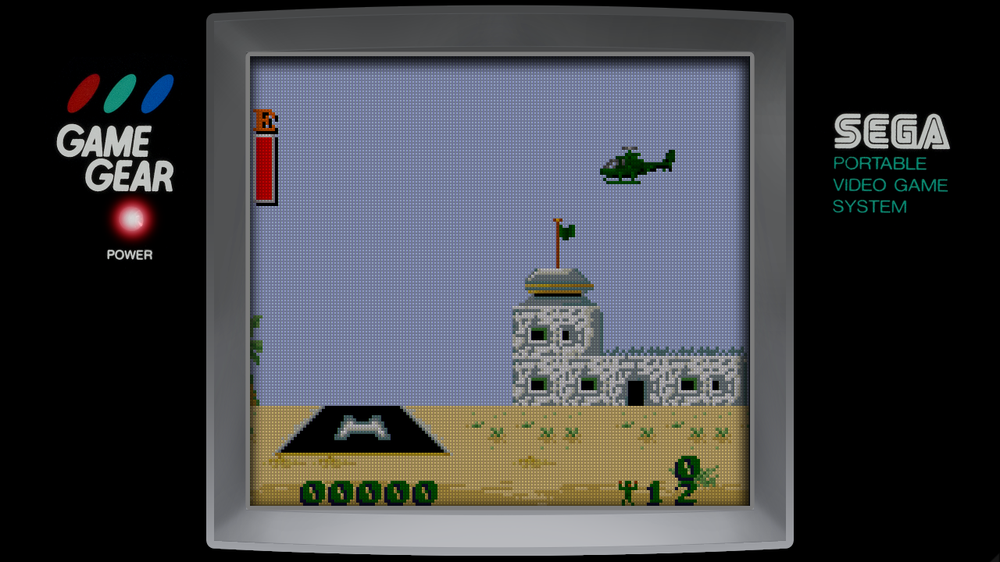
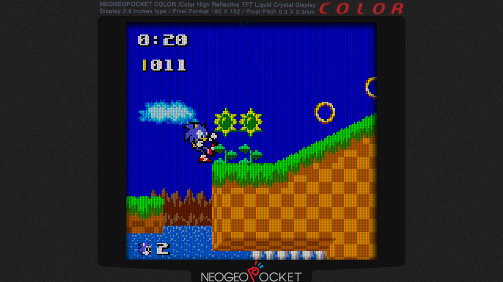

# Covarr's Bezel-Bezels

## :book: Table of Contents
- [Covarr's Bezel-Bezels](#covarrs-bezel-bezels)
  - [:book: Table of Contents](#book-table-of-contents)
  - [:bulb: What is this?](#bulb-what-is-this)
  - [:camera: Screenshots](#camera-screenshots)
  - [:clipboard: Installation \& Setup](#clipboard-installation--setup)
    - [Prerequisites](#prerequisites)
    - [Directions](#directions)
    - [Optional Shader Configuration](#optional-shader-configuration)
    - [Gambatte-Specific Configuration](#gambatte-specific-configuration)
  - [:white\_check\_mark: System Presets](#white_check_mark-system-presets)
  - [:memo: Notes](#memo-notes)
  - [:question: Maybe Asked Questions](#question-maybe-asked-questions)
  - [:inbox\_tray: To Do](#inbox_tray-to-do)
  - [:mega: Credits \& Thanks](#mega-credits--thanks)

## :bulb: What is this?

**In short,** a pack of pixel-perfect 16:9 720p Retroarch overlays for handheld systems based on the actual bezels of the original handhelds.

**In long,** I recently bought a TrimUI Smart Pro, and I wanted to use overlays for various handheld systems it emulates. While there are a lot of quite good overlays out there, none of them were what I was looking for. Overlays based on vertical systems tend either to have a significant amount of black space behind the system or backgrounds that I didn't care for, and overlays based on horizontal systems tend to have visible buttons from the original system, which I thought didn't make a lot of sense for use on a device that already has physical buttons.

What I really wanted was something akin to [Perfect Overlays](https://github.com/ourigen/perfect_overlays/) or [drkhrse Miyoo Bezels](https://github.com/drkhrse/drkhrse_miyoo_bezels). The problem is, those are made for a 4:3 640x480 screen. That matches the majority of emulation handhelds on the market, and while they _could_ be made to work on the TrimUI Smart Pro, they're not really a good fit at all.

So I decided to make my own. These are all based on _just the bezels_ from the original consoles. They have been expanded to fill the TrimUI Smart Pro's 720p screen, with exact integer multiples of the original systems' resolutions for the screen windows, and adjusted to fit key elements such as logos and power LEDs in places I thought looked a little better or more balanced, without being cut off. The intent is to find a good balance between being faithful and looking good on a 16:9 screen.

While these are all intended for the TrimUI Smart Pro, they should also work great on other 1280x720 handhelds. They will also technically work with other 16:9 resolutions, but may not look as good.

## :camera: Screenshots

Game Boy Pocket

Game Boy Color

Game Boy Advance

Game Gear

Neo Geo Pocket Color

## :clipboard: Installation & Setup
> [!NOTE]
>  These directions are written for TrimUI Smart Pro. They may need adjustments for use on other devices.

### Prerequisites
- A working TrimUI Smart Pro
- A microSD card that is already configured for either CrossMix OS (recommended) or the TrimUI Smart Pro stock OS.
- A microSD card reader

### Directions
1. Download and extract the latest `Covarr_Bezel-Bezels_TSP` archive from the release page.
2. Insert your microSD card and copy the `Covarr_Bezel-Bezels_TSP` folder to `(YourCard):\RetroArch\.retroarch\overlay`
3. Put the microSD card into your device and start it up.
4. Launch a game for the system you wish to set up.
5. Press the `Menu` button, and select `Advanced Menu`.
6. In RetroArch's Quick Menu, select `On-Screen Overlay`.
7. Select `Overlay Preset` and navigate to the `Covarr_Bezel-Bezels_TSP` folder.
8. Choose an appropriate config file for the system you are configuring.
9. Select `Overlay Opacity` and set it to `1.00`. You can set the value lower if you'd like an overlay to be darker (especially handy with WonderSwan and other systems with very light bezels).
10. Press B twice to return first to the Quick Menu and then to the RetroArch main menu.
11. Press left and select `Settings`, then select `Video`.
12. Select `Scaling`.
13. Scroll down to `Aspect Ratio` and press right until `Custom` is selected.
14. Set the appropriate numbers for position and width/height as provided in the System Presets chart below.
15. Press B twice to return to the main Settings menu, select `Main Menu` on the left, then select `Quick Menu`.
16. Select `Overrides`, and then `Save Content Directory Overrides`.
17. If you wish to use shaders, continue to Optional Shader Configuration. Otherwise, repeat from step 4 onward for all desired systems.

### Optional Shader Configuration
1. From the Quick Menu, scroll down and select `Shaders`.
2. Select `Load Preset`.
3. Open `shaders_glsl` and then `handheld`.
    - If you are using `Nintendo_GB_DMG_Shader.cfg` for your overlay, select `gameboy.glslp`.
    - Otherwise, select the shader of your choice. Some good options for emulating handheld systems that won't eat too much performance include `lcd3x.glslp` and `simpletex_lcd_720.glslp`.
4. Select `Save Preset`, followed by `Save Content Directory Preset`.

### Gambatte-Specific Configuration
1. From the Quick Menu, scroll down and select `Core Options`.
2. Go to the `GB Colorization` option.
   - If you're using `Nintendo_GB_DMG_Shader.cfg`, select `OFF`.
   - Otherwise, select `Internal`.
3. If you selected `Internal` in the previous step, go to `Internal Palette` and choose a palette that matches the overlay you are using. Otherwise, skip to the next step.
4. Scroll to the top and select `Manage Core Options`.
5. If it's available, select `Save Content Directory Options`. If the option is not available, it should auto-save your changes.
6. If you are using `Nintendo_GB_DMG_Shader.cfg` and have not already done so, complete the Optional Shader Configuration section.

## :white_check_mark: System Presets

<!-- 

720p
 -->

|            System            |               Bezel                |   X   |   Y   | Width | Height |                          Notes                           |
| :--------------------------: | :--------------------------------: | :---: | :---: | :---: | :----: | :------------------------------------------------------: |
|          Atari Lynx          |           Atari_Lynx.cfg           |  240  |  105  |  800  |  510   |                            -                             |
|      Bandai WonderSwan       |           Bandai_WS.cfg            |  192  |  72   |  896  |  576   |                            -                             |
|   Bandai WonderSwan Color    |           Bandai_WSC.cfg           |  192  |  107  |  896  |  576   |               Available in multiple colors               |
|      Bandai SwanCrystal      |           Bandai_SC.cfg            |  192  |  72   |  896  |  576   |                            -                             |
|      Nintendo Game Boy       | Nintendo_GB_ Colorization.cfg |  320  |  96   |  640  |  576   |            Set Gambatte's colorization to DMG            |
|   Nintendo Game Boy (Alt)    |  Nintendo_GB_ DMG_Shader.cfg  |  320  |  96   |  640  |  576   | Disable Gambatte's colorization and use `gameboy` shader |
|   Nintendo Game Boy Pocket   |          Nintendo_GBP.cfg          |  320  |  44   |  640  |  576   |                            -                             |
|   Nintendo Game Boy Light    |          Nintendo_GBL.cfg          |  320  |  44   |  640  |  576   |                            -                             |
|   Nintendo Game Boy Color    |          Nintendo_GBC.cfg          |  320  |  44   |  640  |  576   |                            -                             |
|  Nintendo Game Boy Advance   |          Nintendo_GBA.cfg          |  160  |  19   |  960  |  640   |                            -                             |
| Nintendo Game Boy Advance SP |        Nintendo_GBA_SP.cfg         |  160  |  19   |  960  |  640   |                            -                             |
|        Sega Game Gear        |            Sega_GG.cfg             |  320  |  72   |  640  |  576   |                            -                             |
|      SNK Neo Geo Pocket      |            SNK_NGP.cfg             |  320  |  56   |  640  |  608   |                            -                             |
|   SNK Neo Geo Pocket Color   |            SNK_NGPC.cfg            |  320  |  56   |  640  |  608   |                            -                             |

<!-- 
-->

<!--|   Nintendo DS (Single    |         NDS_TSP_Single.cfg         |       DraStic        |  88 / 680  |    168     |  512  |  384   |               Available in multiple colors               |
|  Nintendo DS (Side by Side)  |          NDS_TSP_SBS.cfg           |       DraStic        |  88 / 680  |    168     |  512  |  384   |               Available in multiple colors               |-->

## :memo: Notes

- Unless otherwise noted, my personal recommendation is to use the `lcd3x` shader alongside these overlays. That's absolutely just down to taste and device performance, though; use what you prefer. `simpletex_lcd_720p` is also a great choice.
- For all systems I recommend using the default emulator provided by CrossMix OS. `Nintendo_GB_Colorization.cfg` in particular will not look right with anything but Gambatte.
- All sizes and positions given as of the current version are intended for the TrimUI Smart Pro's `1280x720` screen. While these overlays will technically work at other 16:9 resolutions, these numbers will need to be adjusted to match.
  - For `1920x1080`, multiply all the numbers above by `1.5`.
  - For `2560x1440`, multiply them by `2`.

## :question: Maybe Asked Questions

<b>Why are there only handheld systems in here?</b>

The purpose of this pack is to provide overlays based on the physical bezels of handhelds' original hardware. When you play a console, you're not looking at the system, you're looking at a television. More talented people than myself have already made some quite nice overlays based on TVs, as well as artwork based on console hardware.

<b>What about this other handheld system?</b>

There are a plethora of reasons I might not do a particular system:

- If it doesn't have a standard bezel to speak of (PSP, PS Vita, PSOne, Game Boy Micro, Atari Lynx II, Game.com), it's outside the scope of this project.
- If the bezel doesn't have any identifying marks or logos (Sega Nomad, DS Lite), it's not a guaranteed "no" but it is a lower priority, since there's little benefit to this type of overlay for these systems.
- If it doesn't have a RetroArch core that runs acceptably on the TrimUI Smart Pro (Game.com, PS Vita, DS, DS Lite), there's no way to apply it, so there's no point making one.
- If the system is already a 16:9 aspect ratio or extremely close (PSP, PS Vita), you're better off just not using an overlay.
- If it's a calculator (TI-83), trying to emulate it on a handheld without a touchscreen will be an _awful_ time and I don't want anything to do with it.
- If it's a handheld version of a TV console (PSOne, Sega Nomad), I'm not interested; I'd prefer to use a TV bezel instead.

I did experiment with PSP anyway, and found that there was no way to make it not look stupid. It has buttons inline with the logo; including them meant including purely aesthetic non-pushable buttons, something I explicitly wanted to avoid, and omitting them looked really weird and inauthentic.

<b>Why are there no color alternates for some handhelds?</b>

While many '90s and '00s handheld systems came in several different colors, those differences didn't usually extend to the bezel. I've included them where they make sense, but they really don't for most systems.

<b>Any plans to support other resolutions?</b>

At least to begin with, this is something I'm mainly making for myself, so I'm more interested in supporting my own devices (I own a TrimUI Smart Pro and a Steam Deck). I'm not _opposed_ to making alternates for other resolutions or sizes of handhelds if people want them, though. 1080p is an obvious and likely candidate due to a fairly broad range of devices that use it. 750p is also under consideration, since even though only a few devices use it that I'm aware of (the Retroid Pocket 3/4 lines), they are fairly popular devices for emulation.

Very few handhelds have 1200p or 1600p displays, and I can't find any at all that run at 1440p, so I won't be making anything for these resolutions unless I see _significant_ demand, which I do not expect.

<b>Why are Game Gear games narrower than the real thing?</b>

The Game Gear is kind of an outlier. The screen has the same resolution as the GB/GBC, but the pixels are wider than they are tall, giving it a 4:3 aspect ratio. Unfortunately, this pack's goal of using exact integers for clean pixel counts doesn't play nice with the Game Gear's oddball screen. I had to make a choice, and I chose consistency with the pack over accuracy to the original system. This decision was also impacted by the Game Gear's library containing a significant number of ports from Sega Master System, a system which did, in fact, render square pixels.

That being said, if there proves to be demand for a 4:3 alternate, I'm open to creating one at some point down the line. Just be prepared for a bit of shimmering, and don't expect LCD shaders to look as good as they might for other systems.

<b>What about a vertical layout for DS?</b>

Trust me, you don't want this.

## :inbox_tray: To Do

- [ ] Write more detailed instructions
- [ ] Make 1280x800 (16:10) variants for Steam Deck
- [ ] Make 1920x1080 variants for AYN Odin, Retroid Pocket 5, ROG Ally etc.
- [ ] Add more systems:
  - [ ] Mega Duck
  - [ ] Pokémon Mini
  - [ ] Watara Supervision
  - [ ] Nintendo DS/DS Lite (maybe for Steam Deck?)

## :mega: Credits & Thanks
- Wikipedia and Amazon, for reference images
- Google Fonts, for fonts
- Logopedia, for some high quality logos
- Affinity Photo, for not being an Adobe product
- Retro Game Corps and Wulff Den, for getting me interested in emulation handhelds, and for Russ's extremely useful tutorials
- Cizia, for [Crossmix OS](https://github.com/cizia64/CrossMix-OS/)
- [Jeltron](https://github.com/Jeltr0n), [mugwomp93](https://github.com/mugwomp93/muOS_Customization), [drkhrse](https://github.com/drkhrse/drkhrse_miyoo_bezels), [1playerinsertcoin](https://www.reddit.com/user/1playerinsertcoin/submitted/), and [ourigen](https://github.com/ourigen/perfect_overlays/) for inspiration with their own bezel works
- Mixx, for telling me when the TrimUI Smart Pro was on sale and convincing me to finally buy one
- aruss8 and Bann for plenty of encouragement
- Probably several people I've forgotten   
- Not Adobe
