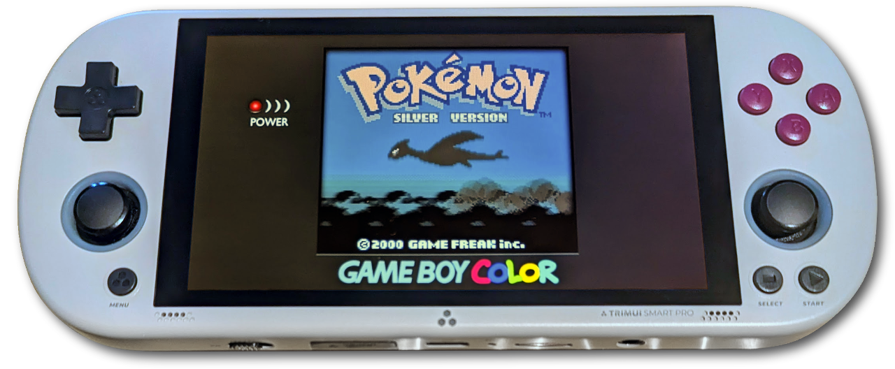
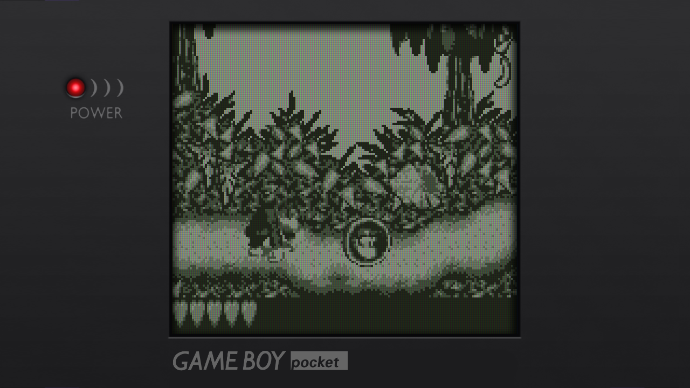
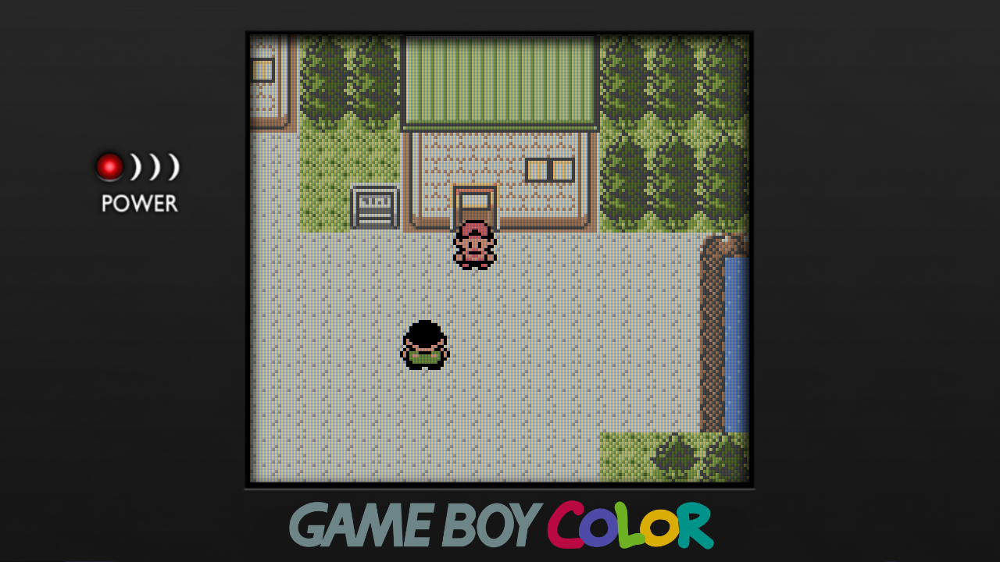
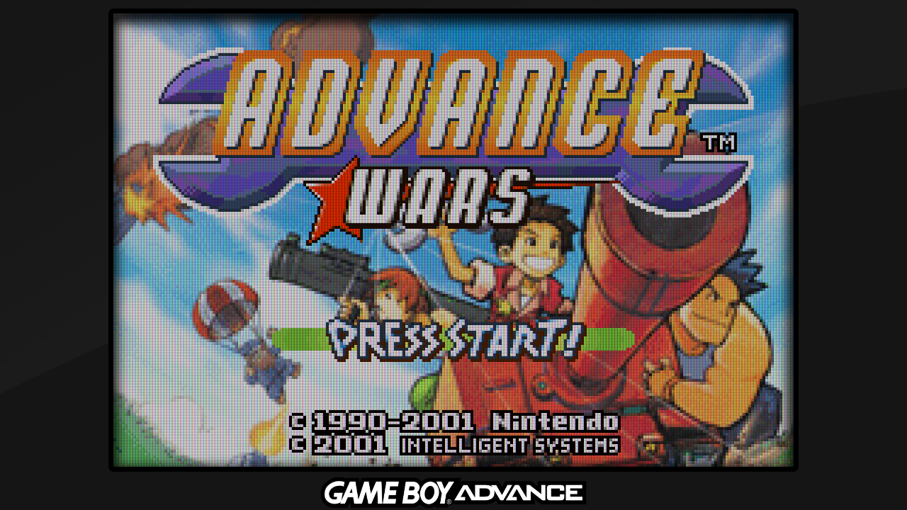
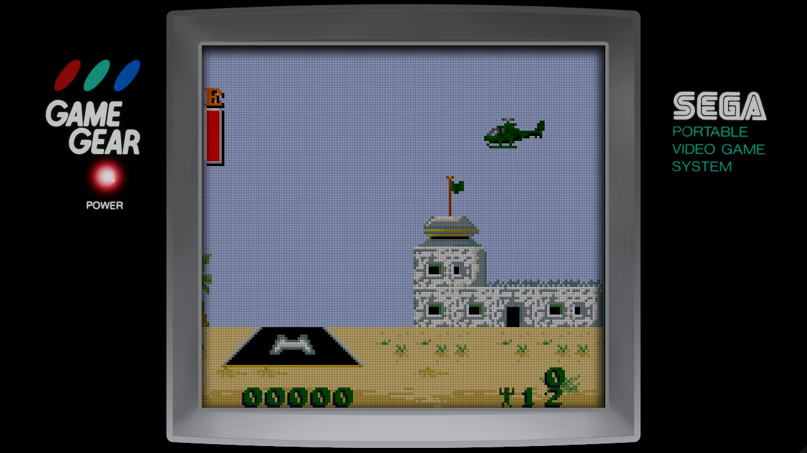
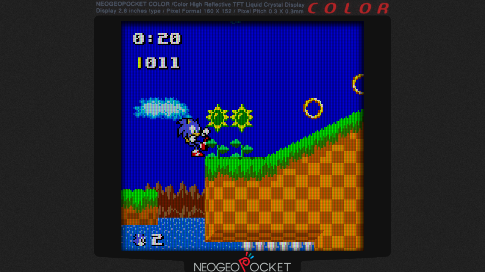

# Covarr's Bezel-Bezels

## :book: Table of Contents
- [Covarr's Bezel-Bezels](#covarrs-bezel-bezels)
  - [:book: Table of Contents](#book-table-of-contents)
  - [:bulb: What is this?](#bulb-what-is-this)
  - [:camera: Screenshots](#camera-screenshots)
  - [:clipboard: Installation \& Setup](#clipboard-installation--setup)
  - [:white\_check\_mark: Supported Systems](#white_check_mark-supported-systems)
  - [:computer: Supported Resolutions](#computer-supported-resolutions)
  - [:question: Maybe Asked Questions](#question-maybe-asked-questions)
  - [:inbox\_tray: To Do](#inbox_tray-to-do)
  - [:mega: Credits \& Thanks](#mega-credits--thanks)

## :bulb: What is this?

**In short,** a pack of pixel-perfect 16:9 and 16:10 Retroarch overlays for handheld systems based on the actual bezels of the original handhelds.

**In long,** In 2024, I bought my first retro emulation handheld, and I wanted to use overlays for various handheld systems it emulates. While there are a lot of quite good overlays out there, none of them were what I was looking for. Overlays based on vertical systems tend either to have a significant amount of black space behind the system or backgrounds that I didn't care for, and overlays based on horizontal systems tend to have visible buttons from the original system, which I thought didn't make a lot of sense for use on a device that already has physical buttons.

What I really wanted was something akin to [Perfect Overlays](https://github.com/ourigen/perfect_overlays/) or [drkhrse Miyoo Bezels](https://github.com/drkhrse/drkhrse_miyoo_bezels). The problem is, those are made for a 4:3 640x480 screen. That matches the majority of emulation handhelds on the market, and while they _could_ be made to work on a 16:9 device, they're not really a good fit at all.

So I decided to make my own. These are all based on _just the bezels_ from the original consoles. They have been expanded to fill a 16:9 screen, with exact integer multiples of the original systems' resolutions for the screen windows, and adjusted to fit key elements such as logos and power LEDs in places I thought looked a little better or more balanced, without being cut off. The intent is to find a good balance between being faithful and looking good on a widescreen handheld display.

While these were originally all intended for the TrimUI Smart Pro, the pack's scope has been broadened to support other 16:9 and 16:10 handheld resolutions such as the Steam Deck, the Retroid Pocket 3/4, the ASUS ROG Ally, the AYN Odin 2, and more.

## :camera: Screenshots

Game Boy Pocket

Game Boy Color

Game Boy Advance

Game Gear

Neo Geo Pocket Color

## :clipboard: Installation & Setup
[Installation and configuration instructions can be found on the wiki.](https://github.com/Covarr/covarr-bezel-bezels/wiki/Installation-%26-Setup)

## :white_check_mark: Supported Systems

<b>Atari</b>

- Lynx

<b>Bandai</b>

- WonderSwan
- WonderSwan Color
- SwanCrystal

<b>Nintendo</b>

- Game Boy
- Game Boy Pocket
- Game Boy Light
- Game Boy Advance
- Game Boy Advance SP

<b>Sega</b>

- Game Gear

<b>SNK</b>

- Neo Geo Pocket
- Neo Geo Pocket Color

## :computer: Supported Resolutions

<b>16:9</b>

- 1280 x 720
- 1344 x 750
- 1920 x 1080
- 2560 x 1440

<b>16:10</b>

- 1280 x 800
- 1920 x 1200
- 2560 x 1600

## :question: Maybe Asked Questions

<b>Why are there only handheld systems in here?</b>

The purpose of this pack is to provide overlays based on the physical bezels of handhelds' original hardware. When you play a console, you're not looking at the system, you're looking at a television. More talented people than myself have already made some quite nice overlays based on TVs, as well as artwork based on console hardware.

<b>What about this other handheld system?</b>

There are a plethora of reasons I might not do a particular system:

- If it doesn't have a distinct bezel to speak of (PSP, PS Vita, PSOne, Game Boy Micro, Atari Lynx II, Game.com), it's outside the scope of this project.
- If the bezel doesn't have any identifying marks or logos (Sega Nomad, DS Lite), it's not a guaranteed "no" but it is a lower priority, since there's little benefit to this type of overlay for these systems.
- If it's a calculator (TI-83), trying to emulate it on a handheld without a touchscreen will be an _awful_ time and I don't want anything to do with it.
- If it's a handheld version of a TV console (PSOne, Sega Nomad), I recommend using a TV bezel instead. There are plenty of great bezels out there, but that's outside the scope of this project.

I did experiment with PSP anyway, and found that there was no way to make it not look stupid. It has buttons inline with the logo; including them meant including purely aesthetic non-pushable buttons, something I explicitly wanted to avoid, and omitting them looked really weird and inauthentic.

<b>Why are there no color alternates for some handhelds?</b>

While many '90s and '00s handheld systems came in several different colors, those differences didn't usually extend to the bezel. I've included them where they make sense, but they really don't for most systems.

<b>Any plans to support other resolutions?</b>

The current release supports pretty much every 16:9 and 16:10 resolution you're likely to find on a handheld. Narrower aspect ratios are not likely as they would require significant redesigns, and wider aspect ratios are not likely as they are mainly used on phones, with so many different unique resolutions, often that are only on one or two devices. I'm not strictly opposed to doing this at some point in the future, but it's a pretty deep rabbithole that I don't especially want to go down for what would likely see little use.

The only other common resolution I can think of that I'm missing is 4K. I may do this in the future, but it's a low priority as it's primarily seen on larger screens and not handhelds.

<b>Why are Game Gear games narrower than the real thing?</b>

The Game Gear is kind of an outlier. The screen has the same resolution as the GB/GBC, but the pixels are wider than they are tall, giving it a 4:3 aspect ratio. Unfortunately, this pack's goal of using exact integers for clean pixel counts doesn't play nice with the Game Gear's oddball screen. I had to make a choice, and I chose consistency with the pack over accuracy to the original system. This decision was also informed by the Game Gear's library containing a significant number of ports from Sega Master System, a system which did, in fact, render square pixels.

That being said, if there proves to be demand for a 4:3 alternate, I'm open to creating one at some point down the line. Just be prepared for a bit of shimmering, and don't expect LCD shaders to look as good as they might for other systems.

<b>What about a vertical layout for DS?</b>

Trust me, you don't want this on a widescreen device.

## :inbox_tray: To Do

- [x] Make a wiki for cleaner instructions
- [x] Make 1280x800 (16:10) variants for Steam Deck
- [x] Make 1920x1080 variants for AYN Odin, Retroid Pocket 5, ROG Ally etc.
- [ ] Add more systems:
  - [ ] Mega Duck
  - [ ] Pokémon Mini
  - [ ] Watara Supervision
  - [ ] Nintendo DS/DS Lite (maybe for Steam Deck?)

## :mega: Credits & Thanks
- Wikipedia and Amazon, for reference images
- Google Fonts, for fonts
- Logopedia, for some high quality logos
- Affinity Photo, for not being an Adobe product
- Retro Game Corps and Wulff Den, for getting me interested in emulation handhelds, and for Russ's extremely useful tutorials
- Cizia et al., for [Crossmix OS](https://github.com/cizia64/CrossMix-OS/)
- [Jeltron](https://github.com/Jeltr0n), [mugwomp93](https://github.com/mugwomp93/muOS_Customization), [drkhrse](https://github.com/drkhrse/drkhrse_miyoo_bezels), [1playerinsertcoin](https://www.reddit.com/user/1playerinsertcoin/submitted/), and [ourigen](https://github.com/ourigen/perfect_overlays/) for inspiration with their own bezel works
- Mixx, for telling me when the TrimUI Smart Pro was on sale and convincing me to finally buy my first emulation handheld
- aruss8 and Bann for plenty of encouragement
- Probably several people I've forgotten   
- Not Adobe